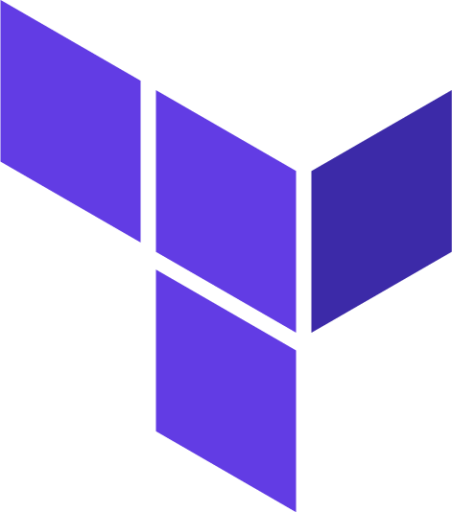
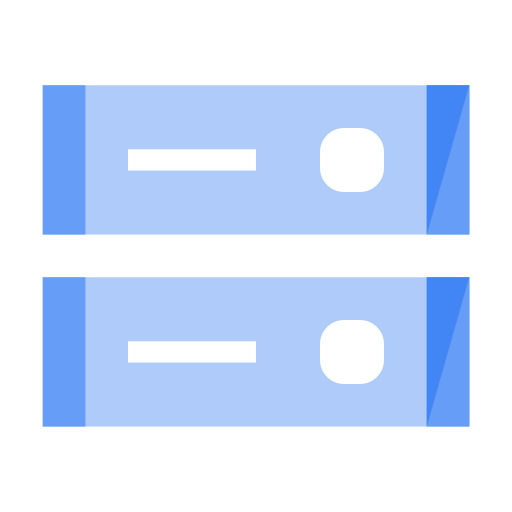

# Quiz Engine
[]()


The main purpose of this application is to provide a solution which is supporting self-development and practice exams. The content can be managed easyly according to any custom needs. The generated Quiz website can be published for a public accessibility or it can be shared within a team and restrict the access by granting permission only for specific Google-Users, -Groups or -Domains.

# Overview
The Quiz Engine was designed for Google Cloud. The solution was developed by using services on a low-cost (or even free) way, but still having the possibility to scale-up if necessary.


## Resources

### Terraform  
All required components are deployed with Terraform scripts. The customization can be done in the `terraform.tfvars` file.

### App Engine  
The Python-based application is deployed to an App Engine instance in a dedicated Google Cloud project.
The main components are:
- Python
- Flask
- HTML/CSS
- Jinja templates

### Firestore  
This noSQL database is used for storing all the documents (categories, groups, questions).

### Cloud Storage  
- Storage bucket ***quiz-engine-storage-app***: location for the `app.zip` file, used by the App Engine
- Storage bucket ***quiz-engine-storage-db-exports***: location for the database exports, created by the admin user


### Identity-Aware Proxy  
<p>The Identity-Aware Proxy (IAP) allows to restrict the access for specific Google-Accounts, or make the access possible for the public.</p>

### Secret Manager  
Sensitive information like the admin password is stored in Secret Manager.

## Key Features
- Quiz mode
  - Select main category
  - Select sub category
  - Select question group
  - Start Quiz (questions and answers are randomized by default)
- Edit mode
  - All Quiz mode functionalities
  - Add/Edit/Delete main category
  - Add/Edit/Delete sub category
  - Add/Edit/Delete question group
  - Add/Edit/Delete questions
  - Database Export/Import

## Database
The database is located in the Collection ***quiz_db*** in Firestore. The following document types are used inside the database:
- main-category
- sub-category
- group
- question


### Document JSON schemas
#### Main Category
```
{
    "$schema": "http://json-schema.org/draft-07/schema#",
    "type": "object",
    "properties": {
        "id": {"type": "string"},
        "name": {"type": "string"},
        "type": {"const": "main-category"}
    },
    "required": [
        "type",
        "name",
        "id"
    ]
}
```

#### Sub Category
```
{
    "$schema": "http://json-schema.org/draft-07/schema#",
    "type": "object",
    "properties": {
        "id": {"type": "string"},
        "name": {"type": "string"},
        "main_category_id": {"type": "string"},
        "type": {"const": "sub-category"}
    },
    "required": [
        "type",
        "name",
        "main_category_id",
        "id"
    ]
}
```

#### Question Group
```
{
    "$schema": "http://json-schema.org/draft-07/schema#",
    "type": "object",
    "properties": {
        "id": {"type": "string"},
        "name": {"type": "string"},
        "sub_category_id": {"type": "string"},
        "type": {"const": "group"}
    },
    "required": [
        "type",
        "name",
        "sub_category_id",
        "id"
    ]
}
```

#### Question
```
{
    "$schema": "http://json-schema.org/draft-07/schema#",
    "type": "object",
    "properties": {
        "id": {"type": "string"},
        "question": {"type": "string"},
        "documentation": {"type": "string"},
        "solution_comment": {"type": "string"},
        "group_id": {"type": "string"},
        "answers": {
            "type": "array",
            "items": {
                "type": "object",
                "properties": {
                    "answer": {
                        "type": "string"
                    },
                    "comment": {
                        "type": "string"
                    },
                    "correct": {
                        "type": "boolean"
                    }
                },
                "required": [
                    "answer",
                    "correct"
                ]
            }
        },
        "type": {"const": "question"}
    },
    "required": [
        "type",
        "name",
        "group_id",
        "answers",
        "id"
    ]
}
```

# Installation

## Prerequisites
### Resources
- Google Cloud environment
- Billing Account

### Required Permissions
- Project Creator role (roles/resourcemanager.projectCreator)
- Billing Account User role (roles/billing.user)

## Deployment
### Get the code
(This step can be done e.g. in a Cloud Shell terminal)
```
git clone https://github.com/khelmric/quiz-engine.git
cd quiz-engine
```
### Update the Terraform variables
```
vi terraform.tfvars
```
#### Variables
| **Variable**    | **Description**                          | **Type**     | **Mandatory** | **Default**      | **Example**                                                                             |
|-----------------|------------------------------------------|--------------|---------------|------------------|-----------------------------------------------------------------------------------------|
| org_id          | Organization ID                          | string       | yes           | null             | "123456789"                                                                             |
| project_id      | Project ID                               | string       | yes           | null             | "quiz-engine"                                                                           |
| billing_account | Billing Account ID                       | string       | yes           | null             | "012345-6789AB-CDEFGHIJ"                                                                |
| suffix          | Resource suffix                          | string       | yes           | null             | "0001"                                                                                  |
| project_name    | Project display name                     | string       | no            | "Quiz Engine"    | "Team Quiz"                                                                             |
| location        | Resource location                        | string       | no            | "us-west1"       | "europe-west3"                                                                          |
| admin_password  | Admin password to activate the edit-mode | string       | no            | "quizEngine123!" | "V%234=gRTT_25"                                                                         |
| web_app_members | Allowed accounts to access the website   | list(string) | no            | [  "allUsers"  ] | [ "user:john.doe@example.com", "group:sample-group@example.com", "domain:example.com" ] |
| max_instances   | App Engine max instances                 | number       | no            | 2                | 4                                                                                       |


### Set the Application Default Credentials
Login with your user credentials to use it for Application Default Credentials
```
gcloud auth application-default login
```
### Execute the Terraform code
```
terraform init
terraform plan
terraform apply
```
### Post-installation steps
#### Turn on IAP
All related resources will be configured by Terraform, but the IAP itself will not be turned on by default and has to be done manually.
- Go to https://console.cloud.google.com/security/iap (make sure, that the right project is selected)
- In the IAP column for App Engine app turn the switch to the on state
- Confirm

#### OAuth brand data
Only "Organization Internal" brands can be created programmatically via API. To convert it into an external brands please use the GCP Console. Otherwise only internal accounts (from the registered domain) will be allowed.
- Go to https://console.cloud.google.com/apis/credentials/consent (make sure, that the right project is selected)
- Click "MAKE EXTERNAL"
- Select the "In production" option
- Confirm

# Usage
## Navigate and start a quiz


## Switch to edit-mode


# License
The Quiz Engine is licensed under the terms of the GPL Open Source license and is available for free.

